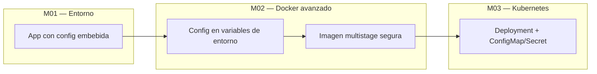

# M02 — Docker avanzado y diseño cloudnative

[← Página anterior](../M01-entorno-codespace-kind/M01-02-aplicacion-demo.md) · [Siguiente página →](M02-01-adaptacion-cloudnative.md)

> [!NOTE]
> **Cómo funciona este módulo.** Primero lees la **teoría y el contexto** (este README), después sigues la **demostración guiada** que hace el formador en clase, y por último practicas en los **laboratorios** M02-01 y M02-02.

## Qué aprenderás

Al terminar este módulo serás capaz de:

- Explicar la diferencia entre **configuración** (cambia según entorno) y **código** (igual en todos los entornos).
- Transformar una aplicación con parámetros embebidos en una app **cloudnative** usando variables de entorno.
- Distinguir **liveness** (`/health`) y **readiness** (`/ready`) y por qué Kubernetes necesita ambos.
- Leer y escribir un `Dockerfile` **multistage** con usuario no-root y capas optimizadas para caché.
- Argumentar cuándo una optimización aporta seguridad, tamaño o velocidad de build — no solo MB en disco.

## Contexto: qué trae M01 y qué resuelve M02

En **M01** levantaste la app demo en Docker Compose y viste que `api.py` contenía URLs y credenciales **dentro del código**. Eso funciona en un único entorno de laboratorio, pero en producción suele haber **dev**, **staging** y **prod** — cada uno con distinta base de datos, distinto Redis y distintos secretos.

Si la URL de Postgres está hardcodeada, **cada cambio de entorno obliga a recompilar la imagen**. Eso rompe dos ideas clave del mundo cloudnative:

1. **Imagen inmutable** — construyes una vez, despliegas muchas veces.
2. **Configuración externa** — el mismo artefacto recibe distinta config en runtime.

M02 cierra esa brecha **antes** de entrar en Kubernetes (M03): primero perfeccionas la app y su imagen en Docker; luego la empaquetas y despliegas en K8s.



## Teoría

### Configuración vs código: la regla de oro

| | **Código** | **Configuración** |
|---|------------|-------------------|
| **Qué es** | Lógica de negocio, endpoints, algoritmos | URLs, puertos, credenciales, flags |
| **Dónde vive** | Git (repositorio) | `.env`, ConfigMap, Secret, variables del orquestador |
| **Cuándo cambia** | Cada release / versión | Cada entorno o despliegue |
| **En M02 (Docker)** | `api.py` | `infra/.env` + `env_file` en Compose |
| **En M03 (K8s)** | Imagen del contenedor | ConfigMap + Secret |

> [!IMPORTANT]
> **No confundas «externalizar» con «subir secretos a Git».** El fichero `infra/.env` está en `.gitignore`. En Git solo va `.env.example` (plantilla sin secretos reales). En Kubernetes los passwords irán a **Secret**, no a ConfigMap.

### Los 12 factores relevantes para este módulo

La metodología **12-Factor App** resume buenas prácticas para apps en la nube. De momento te interesan tres:

| Factor | Idea en una frase | Cómo lo aplicamos en M02 |
|--------|-------------------|---------------------------|
| **III — Config** | Toda config en el entorno | `os.environ` + `.env` |
| **IX — Disposability** | Arranque rápido y parada limpia | `/health` y `/ready` |
| **XII — Logs** | Logs como flujo de eventos | *(M08 — observabilidad)* |

### Health vs Ready: no es lo mismo

Kubernetes (y otros orquestadores) preguntan dos cosas distintas al contenedor:

| Probe | Pregunta | Endpoint típico | Si falla… |
|-------|----------|-----------------|-----------|
| **Liveness** | ¿El proceso sigue vivo? | `GET /health` | Reinicia el contenedor |
| **Readiness** | ¿Puede recibir tráfico? | `GET /ready` | Lo saca del balanceador (pero no lo mata) |

**Ejemplo:** la API arranca pero Postgres aún no está listo. `/health` responde 200 (Python funciona), pero `/ready` responde 503 (sin DB no debe recibir peticiones `/work`). Cuando Postgres esté up, `/ready` pasará a 200.

> [!TIP]
> **Regla práctica:** `/health` debe ser barato (sin llamadas externas). `/ready` puede comprobar dependencias críticas (DB, cache, cola).

### Imágenes Docker: monolito vs multistage

Un **Dockerfile monolítico** hace todo en una sola imagen: instala dependencias, copia código y ejecuta. Es simple de leer, pero la imagen final incluye **todo lo del build** (caché pip, capas intermedias innecesarias) y suele correr como **root**.

Un **multistage build** usa varias etapas (`AS builder`, `AS runtime`):

```text
┌─────────────────┐     ┌─────────────────┐
│  Stage builder  │     │  Stage runtime  │
│  pip install    │ ──► │  solo runtime   │
│  (descartado)   │     │  USER app       │
└─────────────────┘     └─────────────────┘
         │                       │
         └──── imagen final ─────┘
              (más limpia)
```

Beneficios habituales:

- **Seguridad** — usuario no-root (`USER app`).
- **Caché** — `requirements.txt` antes que `api.py` → rebuilds más rápidos en CI.
- **Tamaño** — a veces menor; con bases `slim` la diferencia en MB puede ser modesta, pero la separación de responsabilidades sigue siendo buena práctica.

> [!WARNING]
> **Multistage no siempre reduce muchos MB** con imágenes `python:3.12-slim`. El valor pedagógico aquí es la **estructura** (builder/runtime, no-root, orden de capas), no solo el número en `docker images`.

### Anti-patrón (M01) vs buena práctica (M02)

| Área | Anti-patrón (M01) | Buena práctica (M02) |
|------|-------------------|----------------------|
| Configuración | `DATABASE_URL = "postgres://..."` en código | `os.environ["DATABASE_URL"]` |
| Secretos | Password en el repo | `.env` local gitignored; Secret en K8s |
| Salud | Solo un endpoint genérico | `/health` + `/ready` con semántica clara |
| Imagen | Un stage, proceso root | Multistage, `USER app` (UID 10001) |
| Despliegue | Rebuild por entorno | Misma imagen, distinta config |

## Demostración guiada

> Recorrido que hace el formador en vivo (tono descriptivo).

1. En el editor se abre `infra/app/api/api.py` y se señalan las constantes `DATABASE_URL`, `REDIS_URL` y `API_PORT` — restos del estilo M01.
2. Se muestra la versión refactorizada: `import os` y lectura desde entorno; se explica por qué `DATABASE_URL` no tiene valor por defecto (fallar pronto si falta config).
3. Se añade o revisa el endpoint `/ready` y, con `curl`, se contrasta respuesta 200 frente a 503 al parar Postgres con Compose.
4. Se abre `infra/.env.example`, se copia a `.env` y se modifica `SERVICE_NAME`; tras recrear solo `demo-api`, el JSON de `/health` refleja el nuevo nombre **sin** reconstruir la lógica de negocio.
5. En terminal se ejecuta `./scripts/image-size-compare.sh`: aparecen dos filas (legacy vs multistage). El formador comenta MB, capas y el `uid=10001` dentro del contenedor.
6. Se cierra enlazando con M03: «Esta misma imagen y estas mismas variables las mapearemos a ConfigMap y Secret en Kubernetes».

## Antes de practicar

Comprueba que tienes:

| Requisito | Comando / comprobación |
|-----------|------------------------|
| Stack M01 operativo o scripts listos | `./scripts/lab-up.sh` |
| Clúster kind (para más adelante) | `./scripts/kind-up.sh` |
| Editor en la carpeta del repo | `/workspaces/kubernetes-cloudnative-gitops-301` |

## Ahora practica tú

| Lab | Título | Qué harás | Temario |
|-----|--------|-----------|---------|
| M02-01 | [Adaptación cloudnative](M02-01-adaptacion-cloudnative.md) | Externalizar config, `/ready`, `.env` | LAB 1 |
| M02-02 | [Optimización de imágenes](M02-02-optimizacion-imagenes.md) | Multistage, no-root, comparar tamaños | LAB 2 |

→ Empieza por **[M02-01 — Adaptación cloudnative](M02-01-adaptacion-cloudnative.md)**.

Tras M02-02 continúa con **[M03 — Kubernetes](../M03-kubernetes-desarrolladores/README.md)**.
